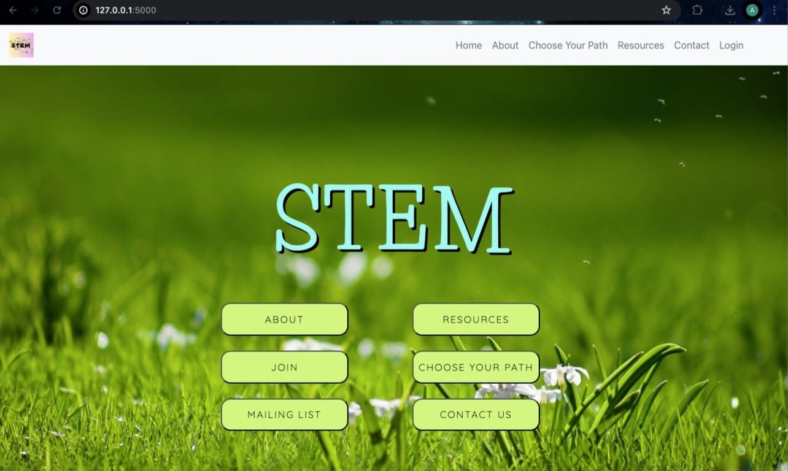
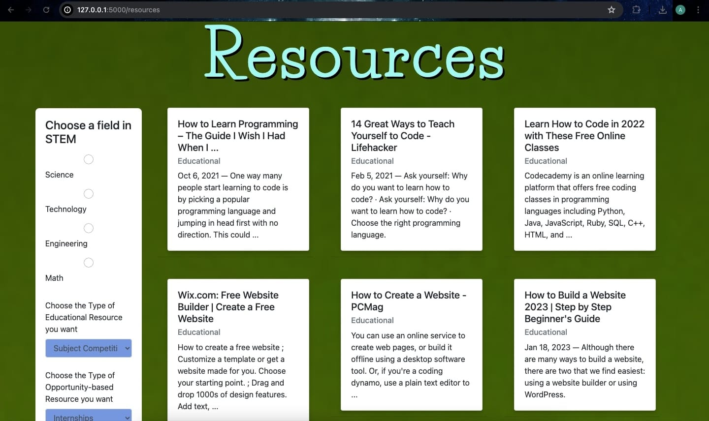

# STEM

## Overview

**STEM** is a web platform designed to support and empower women in STEM fields in India. The site provides educational content about notable Indian women in STEM, offers resources for computer science and related fields, and provides information on internships and entry-level job opportunities. Users can register, log in, and access various features tailored to their career needs.

## Features

- **Home Page**: An introduction to the STEM project and its mission.
- **Resources Page**: Offers educational resources, internship opportunities, and entry-level job listings in STEM fields.
- **About Page**: Contains detailed information about Indian women in STEM, the project's goals, and contact information.
- **Choose Your Path**: A feature that allows users to select their interests or career goals to receive tailored information and resources.

## Screenshots

## Technologies Used

**Frontend:**
- **HTML**: For structuring the web pages.
- **CSS**: For styling and layout.
- **JavaScript**: For interactive elements and client-side scripting.

**Backend:**
- **Python**: Programming language used for server-side logic.
- **Flask**: Micro web framework for building the backend services.
- **Flask-Login**: Extension for managing user sessions and authentication.
- **SQLAlchemy**: ORM (Object-Relational Mapping) tool for interacting with the database.

**Tools & Libraries:**
- **Git**: Version control system for managing code changes.
- **VS Code**: Code editor used for development.

## Installation

To set up the STEM project locally, follow these steps:

1. **Clone the Repository**:
   git clone https://github.com/Aarushi-29/STEM.git

2. **Navigate to the Project Directory**:
   cd STEM

3. **Set Up a Virtual Environment**:
   python -m venv venv

4. **Activate the Virtual Environment**:
   - On Windows:
     venv\Scripts\activate
     
   - On macOS/Linux:
     source venv/bin/activate

5. **Install Dependencies**:
   pip install Flask
   pip install Flask-Login
   pip install SQLAlchemy

7. **Run the Application**:
   python main.py

## Contributing

We welcome contributions! To contribute to the STEM project, please follow these steps:

1. Fork the repository.
2. Create a new branch for your changes.
3. Make your changes and commit them with clear messages.
4. Push your changes to your forked repository.
5. Open a pull request against the main repository.
